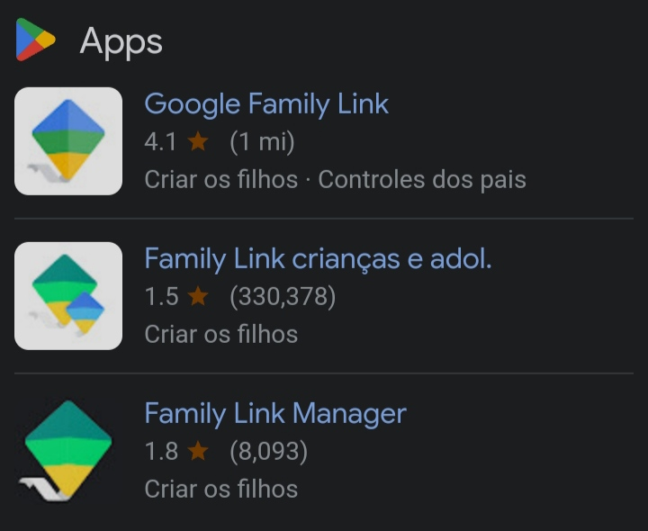

# Famíly link

O aplicativo do Google 

Primeiramente vou explicar oq é o famíly link, é um aplicativo de controle dos país ao celular dos seus filhos. Com ele, você pode:
Bloquear completamente o celular do seu filho para ele não mecher;
Colocar um tempo de quanto tempo seu filho pode usar o celular;
Colocar um horário pra dormir no celular pra fazê-lo bloquear;
Ver a localização do seu filho a cada minuto;
Entre outros;

Bom, esse aplicativo é criado pelo Google com a intenção de ajudar os pais a "cuidar" dos seus filhos com a tecnologia, a ideia até que é boa, pra criança com menos de 8 anos 
E realmente a classificação do aplicativo é de 8 á 10 anos.

Mas agr vc pensa, se juntar pais extremamente controladores e conservadores...

Por que existem muitas pessoas até com 14/15/16 anos que tem esse aplicativo no celular (Como, por exemplo, eu mesmo).

De acordo até com as avaliações da própria "play storie", tiveram adolecentes que até se suicidaram por causa do mesmo.

Então, pelo menos, ano passado, tinha muita gente falando e tentando tirar esse aplicativo da play storie, mas ultimamente não é mais tão mensionado, mas pessoas ainda sofrem por isso até hoje e eu estou aqui pra lembrar

