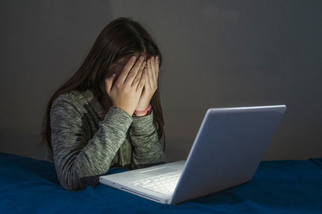

# Jornal do Carmela

Cyberbullying

Cyberbullying é a prática de bullying por meio de ambientes virtuais, como redes sociais e aplicativos de mensagem. O bullying consiste em perseguição, humilhação, intimidação, agressão e difamação sistemática. Quando esses problemas saem da esfera da convivência física e passam para a esfera da convivência virtual, temos o cyberbullying, comum, nos dias de hoje, entre os jovens por conta da popularização do acesso à internet e do uso massivo das redes sociais.

O vocábulo inglês bully significa “valentão” — aquela figura típica do agressor que persegue as suas vítimas na escola, colocando apelidos nelas e fazendo-as passar por situações vexatórias, por meio de agressões físicas e morais. O sufixo -ing acrescido ao termo bully é o que indica a condição da prática de bullying: a persistência e a continuidade. Já o prefixo cyber- vem da palavra cybernetic, que se refere àquilo que tem relação com a internet.

O cyberbullying é a prática do bullying em ambientes virtuais. O bullying pode ser caracterizado por uma violência perseguidora e constante, que pode chegar, nas suas formas mais latentes, a agressões físicas, além de humilhação pública, exposição vexatória, criação de apelidos de mau gosto etc. Já o cyberbullying é a mesma prática, porém ocorre por meio dos canais de comunicação virtuais, o que pode ser mais psicologicamente danoso para a vítima.

 

Enquanto o bullying somente acontece durante o contato presencial entre vítima e agressor, o cyberbullying estende-se para além dos ambientes públicos de convivência, os quais a vítima é obrigada a frequentar por determinados horários. Dessa maneira, o cyberbullying tende a ser mais massacrante, pois não há meio para que a vítima fuja dele, afinal, mesmo em casa, isolada em seu quarto, ela pode receber mensagens ameaçadoras e ofensas em suas redes sociais ou via mensagem de texto

 

Normalmente, quem pratica o cyberbullying esconde-se atrás de perfis falsos de redes sociais, acreditando estar com a identidade totalmente protegida. No entanto, existem mecanismos de rastreamento de agressores e difamadores virtuais, por meio de um número de registro de computadores e redes na internet, chamado endereço I.P., que permite a identificação de qualquer atividade virtual.

Assim sendo, se a vítima de cyberbullying sentir-se afetada pelos chamados crimes contra a honra (calúnia, difamação e injúria) ou até mesmo crimes de injúria racial (quando a agressão tem motivação por raça e etnia), ela está resguardada pelos artigos 138 e 140 do Código Penal brasileiro, respectivamente. Quando houver a divulgação de imagens íntimas, com nudez, conteúdo erótico ou sexual, sem a autorização da vítima, há o resguardo da lei por meio do artigo 218-C do Código Penal Brasileiro.
